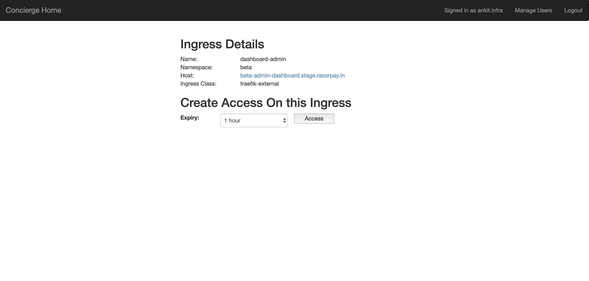

# Concierge-Ingress

It allows us to create leases for incoming connections to Kubernetes Ingress Objects.

## How It Works

It uses **Kubernetes client go** package (Go) to access and make changes in the k8s objects.

## How To Use

1. Any developer having an organization email and login to Ingress-concierge.

2. Homepage have the list of all the ingress from which we can take the lease and it looks like the image added below
    

3. For getting lease to a particular ingress, click on the name of the ingress from the above ingress list shown and you will be forwarded to the page shown below:
    

4. Now select the expiry time for the lease and click on "Access" button.

5. You will get a lease and you can't take the lease again if you already have the active lease.
   

6. You can also terminate the lease or it will automatically get terminated after its expiry time.

 
## Installation

1. Obtain Google client secret and client id for OAuth. 

2. Add `http://127.0.0.1:4180` in **Authorized JavaScript origins** and `http://127.0.0.1:4180/oauth2/callback` in **Authorized redirect URIs**.

3. Get the source code on your machine via git.

    ```shell
    $ git clone --branch ingress-concierge https://github.com/razorpay/concierge.git
    ```

4. Rename file `.env.example` to `.env` and change credentials.

    ```shell
    $ mv .env.example .env
    ```

5. Rename file `oauth2_proxy.example.cfg` to `oauth2_proxy.cfg` in `oauth2_proxy` dir and add the following values obtained from Google OAuth

    ```text
    $ mv oauth2_proxy/oauth2_proxy.example.cfg oauth2_proxy/oauth2_proxy.cfg
    
    $ vi oauth2_proxy/oauth2_proxy.cfg
    client_id =
    client_secret =
    ```

6. Make sure to change the `seeding.go` file in `database` dir with your information else you won't be able to login.

7. Run docker-compose command to run the application.

    ```shell
    $ docker-compose up -d
    ```

8. Check for the running application.

    ```shell
    $ docker ps
    ```

9. Access the application on [http://127.0.0.1:4180](http://127.0.0.1:4180)
